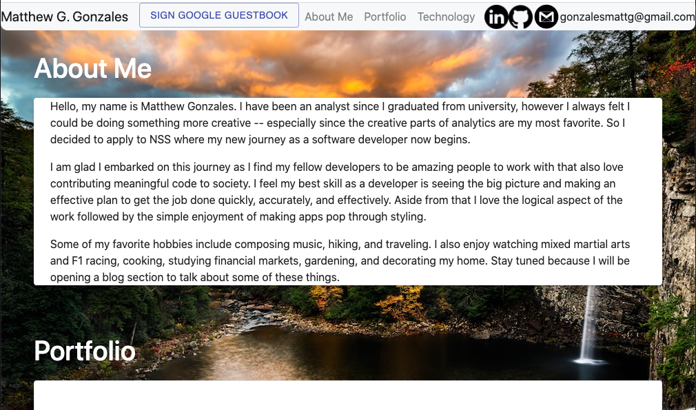

# My Personal Bio Site
  Welcome to my personal bio site which shares a blurb about who I am, why I love developing, my portfolio, and the technologies I know.
### Link to the deployed project
  [Deployed Project](https://matthewggonzales.com)
### Link to your project board
  [Project Board](https://github.com/GonzalesMatthew/react-personal-bio-site/projects/2)
### Description of the user
  For recruiters, hiring managers, or anyone curious about who I am as a developer.
### List of features                                                
  - About Me section
  - Portfolio section - list of projects I've completed
  - Technology section - list of tools I know and use in development
  - Guestbook - lets visitors share their Google contact info with me!
  - Admin sign in - for me, the guestbook lets me sign in to apply CRUD on my projects and technology sections
### Screenshots of your project

### List of contributors and links to their GH profiles
@GonzalesMatthew
### Link to Loom video walkthrough of your app
[App-Walkthrough Video](https://www.loom.com/share/01917e55658a4d34a08381208489cf11)
